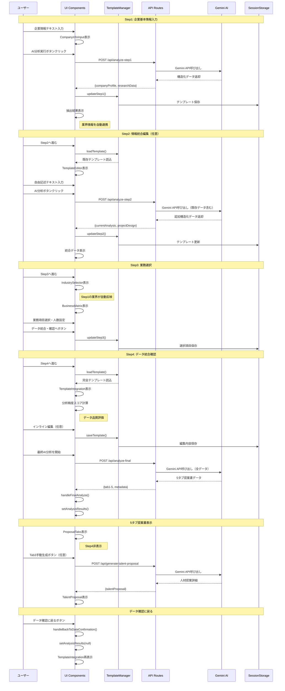
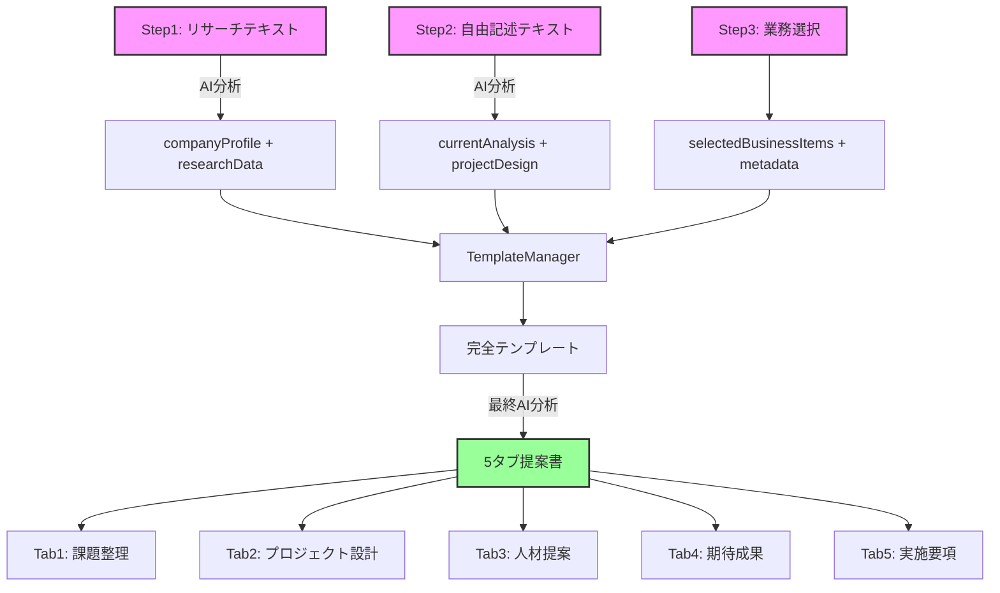
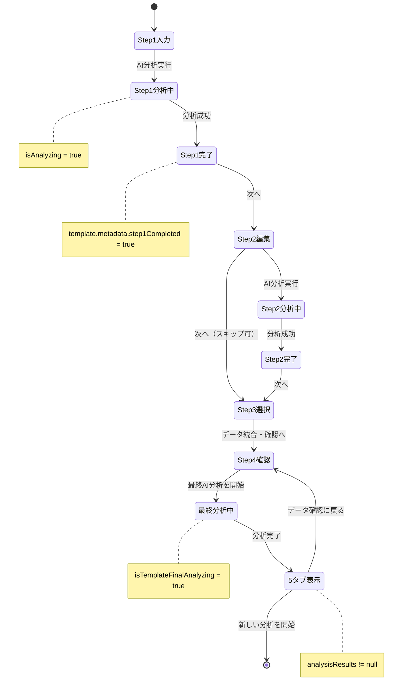
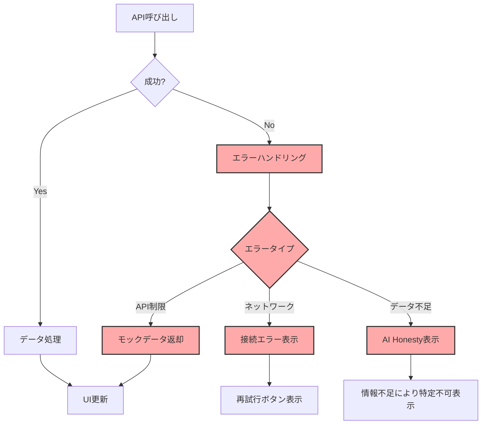
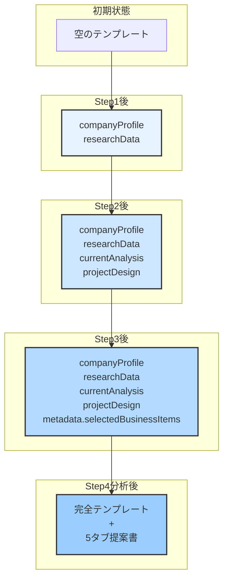
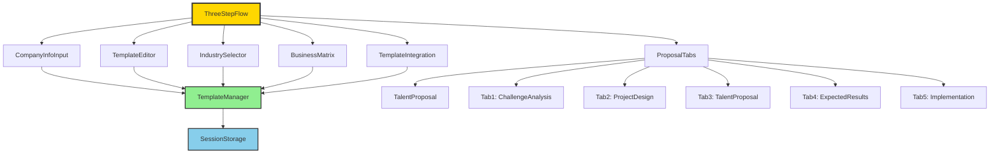

# Lotsful AI Engine - システムデータフロー図

## 概要
このドキュメントは、Lotsful AI Engineの段階的情報蓄積システムのデータフローを可視化したものです。

## システム全体のデータフロー



## データ構造の流れ



## API呼び出し関係

```mermaid
graph LR
    subgraph "フロントエンド"
        A[CompanyInfoInput]
        B[TemplateEditor]
        C[TemplateIntegration]
        D[ProposalTabs]
    end
    
    subgraph "API Routes"
        E[/api/analyze-step1]
        F[/api/analyze-step2]
        G[/api/analyze-final]
        H[/api/generate-talent-proposal]
    end
    
    subgraph "AI Engine"
        I[Gemini 2.5 Flash]
    end
    
    A -->|POST| E
    B -->|POST| F
    C -->|POST| G
    D -->|POST| H
    
    E --> I
    F --> I
    G --> I
    H --> I
    
    style E fill:#fbb,stroke:#333,stroke-width:2px
    style F fill:#fbb,stroke:#333,stroke-width:2px
    style G fill:#fbb,stroke:#333,stroke-width:2px
    style H fill:#fbb,stroke:#333,stroke-width:2px
```

## 状態管理フロー



## エラー処理フロー



## テンプレートデータの蓄積過程



## 主要コンポーネント間の関係



## 使用方法

このMermaid図をGitHub、VSCode、またはMermaid対応のツールで表示することで、システムの動作を視覚的に理解できます。

### 表示方法
1. **GitHub**: このファイルをGitHubで開くと自動的にレンダリングされます
2. **VSCode**: Mermaid Preview拡張機能をインストールして表示
3. **オンラインツール**: [mermaid.live](https://mermaid.live/)にコピペして表示

## 更新履歴
- 2025-06-10: 初版作成 - 4ステップフロー、5タブ生成システム対応